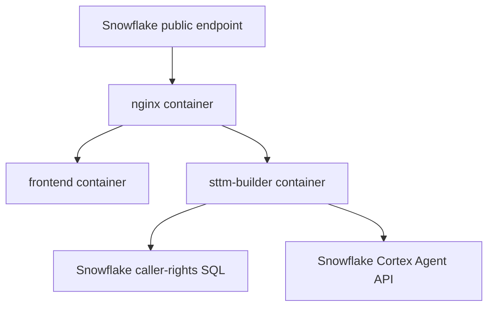

# Client SPCS Deployment Guide

## Purpose

This guide explains how to move the integrated SPCS workbench into a client Snowflake environment where:

- deployment is performed with Snowflake CLI, browser-authenticated Snowflake connections, and Docker
- authentication is handled by the client’s Snowflake + Okta setup
- deployer access may be lower than `ACCOUNTADMIN`

The deployed application model is:

- one SPCS service
- three containers inside that service:
  - `frontend`
  - `nginx`
  - `sttm-builder`
- one public Snowflake ingress endpoint
- backend exposed under `/api/*` through nginx

## Final Deployment Shape



This single-service model is intentional. The earlier split-service approach failed because Snowflake caller-rights user tokens could not be forwarded cleanly across service boundaries.

## Important Design Constraints

### 1. Authentication comes from Snowflake ingress

The backend expects Snowflake caller-context headers:

- `Sf-Context-Current-User`
- `Sf-Context-Current-User-Email`
- `Sf-Context-Current-User-Token`

These are injected only by Snowflake public ingress after the user authenticates with Snowflake / Okta.

The application does **not** expect the frontend to send an Okta token directly.

### 2. Metadata table writes are service-owned

The application updates the users metadata table during login bootstrap. The service owner role therefore needs write access on:

- `USERS_TABLE`

If `USERS_TABLE` is missing, misconfigured, or not writable by the service owner role, the app can deploy but the header/session/persona experience will break.

### 3. Data visibility uses caller rights

Database / schema / table browsing uses the caller’s Snowflake visibility.

That means the following must be true:

- the end-user role can see the objects
- the service owner role has matching caller grants

Without caller grants, the service will authenticate but Snowflake data access will fail or remain too narrow.

## One-Time Client Admin Prerequisites

These steps normally require a client admin role such as `ACCOUNTADMIN`, `SECURITYADMIN`, or a custom platform role with equivalent privileges.

### A. Create or choose the runtime database and schema

The service spec, image repository, and metadata table all depend on a target database/schema.

Use as templates:

- [create-db-ddl.sql](/Users/ankurshome/Desktop/storage/Mr-Bucky/bbi-mig-ai-workbench/infra/snowflake/create-db-ddl.sql)
- [image-registry.sql](/Users/ankurshome/Desktop/storage/Mr-Bucky/bbi-mig-ai-workbench/infra/snowflake/image-registry.sql)

At minimum, the client environment needs:

- a database for runtime objects
- a schema for runtime objects
- an image repository
- a deploy stage

### B. Create or choose the compute pool

Use as a template:

- [compute-pools.sql](/Users/ankurshome/Desktop/storage/Mr-Bucky/bbi-mig-ai-workbench/infra/snowflake/compute-pools.sql)

### C. Create the metadata tables

Use as a template:

- [create-table-ddl.sql](/Users/ankurshome/Desktop/storage/Mr-Bucky/bbi-mig-ai-workbench/infra/snowflake/create-table-ddl.sql)

The minimum required table for login/session bootstrap is:

- `TBL_USERS`

Recommended:

- create the full STTM metadata set

### D. Create the external access integration for Snowflake egress

The backend needs egress to Snowflake host `:443` for:

- caller-rights SQL
- Cortex Agent REST API

Use as a template:

- [setup-egress.sql](/Users/ankurshome/Desktop/storage/Mr-Bucky/bbi-mig-ai-workbench/infra/snowflake/setup-egress.sql)

### E. Add caller grants for the service owner role

Caller grants are required for `executeAsCaller: true`.

Use as a template:

- [setup-caller-grants.sql](/Users/ankurshome/Desktop/storage/Mr-Bucky/bbi-mig-ai-workbench/infra/snowflake/setup-caller-grants.sql)

At minimum, the service owner role needs:

- `BIND SERVICE ENDPOINT ON ACCOUNT`
- caller usage on the target database/schema/warehouse

Depending on the client’s desired visibility model, the client may need broader caller grants than the minimal template.

### F. Grant deployer permissions

The deployer role must be able to:

- log in to the Snowflake image registry
- push images to the target image repository
- create / alter the service
- use the compute pool
- use the external access integration
- read/write the deploy stage

### G. Grant application roles to users

The application maps Snowflake roles to personas using runtime env values:

- `APP_ROLE_ADMIN`
- `APP_ROLE_PUBLISHER`
- `APP_ROLE_VIEWER`

The client can use existing role names. No new role names are required if they already have suitable roles.

### H. Grant Cortex privileges for workbench agent usage

If the workbench chat / auto-map features should work, the role used for the request must have:

- `SNOWFLAKE.CORTEX_USER` or `SNOWFLAKE.CORTEX_AGENT_USER`
- `USAGE` on the deployed Cortex Agent

## Deployer Steps

These steps are what you can run yourself once the prerequisites above are in place.

## Fastest Path

Once the one-time client admin prerequisites are done, the simplest end-to-end command is:

```bash
cd /path/to/bbi-mig-ai-workbench
./scripts/run_client_spcs_browser_deploy.sh --env-file infra/snowflake/env/client.env
```

This wrapper:

1. bootstraps the local tools virtualenv
2. installs `snowflake-cli`
3. creates or reuses the Snow CLI browser-auth connection
4. logs Docker into the Snowflake image registry
5. builds and pushes the three images
6. renders the service spec
7. creates or upgrades the webapp service
8. lists the public endpoints

The detailed steps below break the same process apart for easier troubleshooting.

## Detailed Steps

### 1. Bootstrap the local deployment tools

```bash
cd /path/to/bbi-mig-ai-workbench
./scripts/bootstrap_client_spcs_tools.sh
```

This script:

- creates `.client-tools-venv` if it does not exist
- installs `snowflake-cli`
- verifies Docker is available

### 2. Copy the client env example

```bash
cd /path/to/bbi-mig-ai-workbench
cp infra/snowflake/env/client.env.example infra/snowflake/env/client.env
```

### 3. Fill in client-specific values

Edit:

- `SNOWFLAKE_CONNECTION`
- `SNOWFLAKE_AUTHENTICATOR`
- `SNOWFLAKE_ACCOUNT`
- `SNOWFLAKE_USER`
- `SNOWFLAKE_ROLE`
- `SNOWFLAKE_WAREHOUSE`
- `SNOWFLAKE_DATABASE`
- `SNOWFLAKE_SCHEMA`
- `SNOWFLAKE_REGISTRY_HOST`
- `SNOWFLAKE_IMAGE_REPOSITORY`
- `SNOWFLAKE_COMPUTE_POOL`
- `WEBAPP_SERVICE_NAME`
- `SNOWFLAKE_EGRESS_INTEGRATION`
- `USERS_TABLE`
- `APP_ROLE_ADMIN`
- `APP_ROLE_PUBLISHER`
- `APP_ROLE_VIEWER`
- `SNOWFLAKE_STTM_BUILDER_AGENT`

File:

- [client.env.example](/Users/ankurshome/Desktop/storage/Mr-Bucky/bbi-mig-ai-workbench/infra/snowflake/env/client.env.example)

### 4. Create or validate the Snow CLI connection

```bash
./scripts/configure_client_snow_connection.sh --env-file infra/snowflake/env/client.env
```

This script:

- reuses the tools virtualenv
- creates a named Snow CLI connection using `externalbrowser`
- runs `snow connection test`, which opens browser login if needed

### 5. Build, push, and deploy with Snow CLI

```bash
./scripts/deploy_spcs_client_snow.sh --env-file infra/snowflake/env/client.env
```

This script will:

1. test the Snow CLI connection
2. log Docker into the Snowflake image registry using `snow spcs image-registry login`
3. build and push `sttm-builder`
4. build and push `frontend`
5. build and push `nginx`
6. render the single-service spec
7. create or upgrade the webapp service
8. list the public endpoints

Script:

- [deploy_spcs_client_snow.sh](/Users/ankurshome/Desktop/storage/Mr-Bucky/bbi-mig-ai-workbench/scripts/deploy_spcs_client_snow.sh)

Optional examples:

```bash
./scripts/deploy_spcs_client_snow.sh --env-file infra/snowflake/env/client.env --image-tag client-001
./scripts/deploy_spcs_client_snow.sh --env-file infra/snowflake/env/client.env --skip-build
```

If you want a single wrapper instead of the step-by-step flow, use:

```bash
./scripts/run_client_spcs_browser_deploy.sh --env-file infra/snowflake/env/client.env
```

### 6. Verify service status

Run:

```bash
snow spcs service status <webapp_service_name> \
  -c <connection_name> \
  --database <runtime_db> \
  --schema <runtime_schema>

snow spcs service list-containers <webapp_service_name> \
  -c <connection_name> \
  --database <runtime_db> \
  --schema <runtime_schema>

snow spcs service list-endpoints <webapp_service_name> \
  -c <connection_name> \
  --database <runtime_db> \
  --schema <runtime_schema>
```

### 7. Test browser login

Open the public endpoint returned by `snow spcs service list-endpoints`.

Expected flow:

1. Snowflake public ingress
2. Snowflake login / Okta SAML
3. authenticated session
4. app header shows real username and persona

## Notes On The Legacy Password-Based Wrapper

The repo still contains the earlier password-oriented wrapper:

- [deploy_spcs_client.sh](/Users/ankurshome/Desktop/storage/Mr-Bucky/bbi-mig-ai-workbench/scripts/deploy_spcs_client.sh)

That wrapper depends on:

- password-based registry login
- password-based `snowsql`

It is not the recommended path for client environments where deployment is done through:

- `snow connection add`
- `authenticator=externalbrowser`
- `snow spcs ...`

## Why `feature/client-avd-ready-auth` Deployed But Still Had Metadata Issues

That earlier branch already had the right broad auth direction:

- public ingress
- Okta-backed Snowflake auth
- `executeAsCaller: true`

But the integrated branch adds the missing alignment needed for the current STTM + frontend combination:

- service-owned metadata writes
- correct users table pathing
- integrated frontend session bootstrap APIs
- lazy metadata loading
- final nginx routing for `/api/*`

The “username / persona not showing” symptom in a client environment is usually caused by one of these:

1. `USERS_TABLE` points to the wrong object
2. the table exists but service owner role cannot write to it
3. `APP_ROLE_ADMIN` / `PUBLISHER` / `VIEWER` do not match the client’s real Snowflake roles
4. end-user role is not actually in session

## Why The Current Integrated Branch Is Better For Client Handoff

Compared with the older deployment path:

- it uses direct `snowsql` + Docker scripts rather than AWS-secret-driven helpers
- it is easier to hand to a client-side operator
- the env file is the single place to map client names
- it deploys the final single-service architecture that is already proven to work with caller rights

## Current Scripts Used For Client Deployment

Build and push one image:

- [build-and-push.sh](/Users/ankurshome/Desktop/storage/Mr-Bucky/bbi-mig-ai-workbench/infra/snowflake/scripts/build-and-push.sh)

Deploy the webapp service:

- [deploy.sh](/Users/ankurshome/Desktop/storage/Mr-Bucky/bbi-mig-ai-workbench/infra/snowflake/scripts/deploy.sh)

Run all build + deploy steps together:

- [deploy_spcs_client.sh](/Users/ankurshome/Desktop/storage/Mr-Bucky/bbi-mig-ai-workbench/scripts/deploy_spcs_client.sh)

## Recommended Client Handoff Process

### What the client admin should do once

1. create database/schema/repository/stage
2. create compute pool
3. create metadata tables
4. create egress integration
5. add caller grants
6. grant deployer access
7. grant app roles and Cortex privileges

### What the deployer should do for each rollout

1. update `infra/snowflake/env/client.env`
2. run:

```bash
./scripts/deploy_spcs_client.sh --env-file infra/snowflake/env/client.env
```

3. verify service and endpoint
4. open public URL and test login

This is the cleanest way to take the current integrated repo into a client Snowflake environment.
