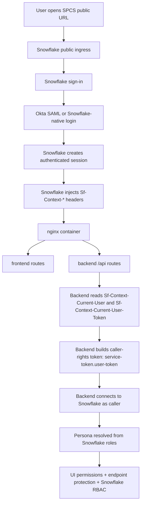
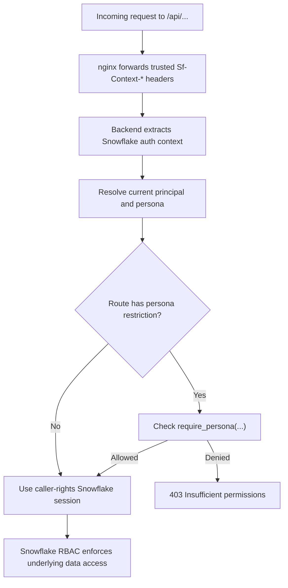

# SPCS Workbench Integration Progress

## Summary

This document captures the final integration design and the implementation work completed on branch `feature/spcs-workbench-integration`.

The integration combined:

- `feature/sttm-endpoints` as the backend and service foundation
- `feature/client-avd-ready-auth` as the Snowflake-ingress / Okta SAML / caller-rights authentication model
- `feature/frontend-development` as the top-level frontend application

The final deployment model is:

- one Snowpark Container Services service
- three containers in that service:
  - `frontend`
  - `nginx`
  - `sttm-builder`
- one public Snowflake ingress endpoint
- backend exposed through the same public endpoint under `/api/*`

This design was chosen because Snowflake caller-rights authentication must stay in the same public service boundary that receives the ingress-authenticated request.

---

## Final Authentication Design

### High-level flow



### Key design points

- The app does **not** accept an Okta JWT directly from the frontend.
- Snowflake is the public authentication boundary.
- Okta participates through Snowflake SAML federation.
- After authentication, Snowflake passes caller context into the service through:
  - `Sf-Context-Current-User`
  - `Sf-Context-Current-User-Email`
  - `Sf-Context-Current-User-Token`
- Backend combines:
  - `/snowflake/session/token`
  - `Sf-Context-Current-User-Token`
- That combined token is used for Snowflake caller-rights access.

### Where this is implemented

- Required Snowflake caller headers:
  - [headers.py](/Users/ankurshome/Desktop/storage/Mr-Bucky/bbi-mig-ai-workbench/services/sttm-builder/app/auth/extractors/headers.py:8)
- Current principal resolution:
  - [dependencies.py](/Users/ankurshome/Desktop/storage/Mr-Bucky/bbi-mig-ai-workbench/services/sttm-builder/app/auth/dependencies.py:11)
- Persona resolution from Snowflake roles:
  - [resolver.py](/Users/ankurshome/Desktop/storage/Mr-Bucky/bbi-mig-ai-workbench/services/sttm-builder/app/auth/persona/resolver.py:24)
- Caller-rights token construction:
  - [snowflake.py](/Users/ankurshome/Desktop/storage/Mr-Bucky/bbi-mig-ai-workbench/services/sttm-builder/app/core/snowflake.py:16)
- SPCS service caller-rights capability:
  - [webapp.yaml.tmpl](/Users/ankurshome/Desktop/storage/Mr-Bucky/bbi-mig-ai-workbench/infra/snowflake/service-specs/webapp.yaml.tmpl:69)
- Trusted header forwarding in nginx:
  - [default.conf](/Users/ankurshome/Desktop/storage/Mr-Bucky/bbi-mig-ai-workbench/nginx/conf.d/default.conf:18)

### Representative backend auth code

```python
def extract_snowflake_context(request: Request) -> dict[str, Any]:
    snowflake_user = request.headers.get("Sf-Context-Current-User")
    snowflake_email = request.headers.get("Sf-Context-Current-User-Email")
    snowflake_user_token = request.headers.get("Sf-Context-Current-User-Token")

    if not snowflake_user or not snowflake_user_token:
        raise HTTPException(status_code=401, detail="Missing Snowflake authentication context")
```

Source:
- [headers.py](/Users/ankurshome/Desktop/storage/Mr-Bucky/bbi-mig-ai-workbench/services/sttm-builder/app/auth/extractors/headers.py:8)

```python
def build_caller_token(user_token: str) -> str:
    if not user_token or not user_token.strip():
        raise AuthenticationError(
            "Sf-Context-Current-User-Token header is absent — "
            "request must arrive through SPCS ingress"
        )
    return f"{get_service_token()}.{user_token.strip()}"
```

Source:
- [snowflake.py](/Users/ankurshome/Desktop/storage/Mr-Bucky/bbi-mig-ai-workbench/services/sttm-builder/app/core/snowflake.py:32)

---

## Authentication, Personas, And Authorization

### Persona model

The application uses three personas:

- `ADMIN`
- `PUBLISHER`
- `VIEWER`

The permission bundles are defined in:
- [permissions.py](/Users/ankurshome/Desktop/storage/Mr-Bucky/bbi-mig-ai-workbench/services/sttm-builder/app/auth/persona/permissions.py:6)

```python
PERSONA_PERMISSIONS: dict[AppPersona, PermissionSet] = {
    AppPersona.VIEWER: PermissionSet(can_read=True),
    AppPersona.PUBLISHER: PermissionSet(
        can_read=True,
        can_edit=True,
        can_publish=True,
    ),
    AppPersona.ADMIN: PermissionSet(
        can_read=True,
        can_edit=True,
        can_publish=True,
        can_manage_users=True,
        can_view_audit=True,
    ),
}
```

### How persona is resolved

Persona is resolved from Snowflake roles currently present in the caller session:

```python
SELECT
    CURRENT_USER() AS CURRENT_USER,
    CURRENT_ROLE() AS CURRENT_ROLE,
    IS_ROLE_IN_SESSION(%s) AS IS_ADMIN,
    IS_ROLE_IN_SESSION(%s) AS IS_PUBLISHER,
    IS_ROLE_IN_SESSION(%s) AS IS_VIEWER
```

Source:
- [resolver.py](/Users/ankurshome/Desktop/storage/Mr-Bucky/bbi-mig-ai-workbench/services/sttm-builder/app/auth/persona/resolver.py:27)

Resolution order is:

1. Admin
2. Publisher
3. Viewer

Source:
- [resolver.py](/Users/ankurshome/Desktop/storage/Mr-Bucky/bbi-mig-ai-workbench/services/sttm-builder/app/auth/persona/resolver.py:14)

### Where role mapping is configured

Role mapping is **runtime configuration**, not hardcoded per client:

- `APP_ROLE_ADMIN`
- `APP_ROLE_PUBLISHER`
- `APP_ROLE_VIEWER`

Defined in:
- [config.py](/Users/ankurshome/Desktop/storage/Mr-Bucky/bbi-mig-ai-workbench/services/sttm-builder/app/core/config.py:43)
- [webapp.yaml.tmpl](/Users/ankurshome/Desktop/storage/Mr-Bucky/bbi-mig-ai-workbench/infra/snowflake/service-specs/webapp.yaml.tmpl:10)

```python
app_role_admin: str = Field(default="WORKBENCH_ADMIN", alias="APP_ROLE_ADMIN")
app_role_publisher: str = Field(default="WORKBENCH_PUBLISHER", alias="APP_ROLE_PUBLISHER")
app_role_viewer: str = Field(default="WORKBENCH_VIEWER", alias="APP_ROLE_VIEWER")
```

This means a client can map existing Snowflake roles to personas without code changes, for example:

```env
APP_ROLE_ADMIN=CLIENT_PLATFORM_ADMIN
APP_ROLE_PUBLISHER=CLIENT_DATA_ENGINEER
APP_ROLE_VIEWER=CLIENT_ANALYST
```

### Endpoint protection model

There are three layers of protection:

1. **Ingress authentication**
   - Snowflake public ingress authenticates the user.
   - Backend rejects requests that do not contain Snowflake caller context headers.

2. **Application persona authorization**
   - `require_persona()` returns `403` when persona is insufficient.
   - Example:
     - `/api/v1/admin/users`
     - `/api/v1/admin/users/{id}/deactivate`
     - require `ADMIN`

3. **Snowflake RBAC and caller-rights**
   - data discovery and object access use caller-rights Snowflake sessions
   - if a caller role cannot see a database / schema / table, the explorer does not show it

Relevant code:

- Request auth and persona requirement:
  - [dependencies.py](/Users/ankurshome/Desktop/storage/Mr-Bucky/bbi-mig-ai-workbench/services/sttm-builder/app/auth/dependencies.py:21)
- Admin route enforcement:
  - [auth router](/Users/ankurshome/Desktop/storage/Mr-Bucky/bbi-mig-ai-workbench/services/sttm-builder/app/auth/router.py:75)

### Endpoint authorization flow



---

## Backend Integration Work

### Base taken from `feature/sttm-endpoints`

The backend base came from Pavan’s branch:

- `services/sttm-builder`
- STTM route layout
- Snowflake connector and service structure
- deployment/build scaffolding

### Major backend changes made

#### 1. Replaced bearer-token model with Snowflake caller-rights

Why:

- the final app is hosted only in SPCS
- browser auth should be Snowflake-ingress-driven
- Snowflake caller-rights is the correct service-local identity model

Changed files:

- [snowflake.py](/Users/ankurshome/Desktop/storage/Mr-Bucky/bbi-mig-ai-workbench/services/sttm-builder/app/core/snowflake.py:16)
- [deps.py](/Users/ankurshome/Desktop/storage/Mr-Bucky/bbi-mig-ai-workbench/services/sttm-builder/app/api/deps.py:32)
- [headers.py](/Users/ankurshome/Desktop/storage/Mr-Bucky/bbi-mig-ai-workbench/services/sttm-builder/app/auth/extractors/headers.py:8)

Representative code:

```python
def get_snowflake_client(
    request: Request,
    settings: Annotated[Settings, Depends(get_settings)],
    role: Annotated[Optional[str], Query(...)] = None,
) -> Generator[SnowflakeClient, None, None]:
    user_token = request.headers.get(_SPCS_USER_TOKEN_HEADER, "")
    effective_role = role or _default_role_for_principal(request, settings)
    client = SnowflakeClient(user_token=user_token, role=effective_role)
```

Source:
- [deps.py](/Users/ankurshome/Desktop/storage/Mr-Bucky/bbi-mig-ai-workbench/services/sttm-builder/app/api/deps.py:32)

#### 2. Added session, permissions, and Snowflake-context APIs

Why:

- frontend needed real user/session/bootstrap APIs
- app needed to expose resolved persona and current Snowflake context

Changed file:

- [auth router](/Users/ankurshome/Desktop/storage/Mr-Bucky/bbi-mig-ai-workbench/services/sttm-builder/app/auth/router.py:22)

Representative code:

```python
@auth_router.get("/session", response_model=SessionResponse)
def get_session(
    current_principal: CurrentPrincipal = Depends(get_current_principal),
) -> SessionResponse:
    return SessionResponse(
        user_id=current_principal.user_id,
        email=current_principal.email,
        display_name=current_principal.display_name,
        app_persona=current_principal.app_persona,
        ui_permissions=current_principal.permissions,
    )
```

#### 3. Added persona resolution and app metadata upsert

Why:

- app needed a stable application persona model on top of Snowflake roles
- user deactivation and app metadata should be service-owned, not caller-owned

Changed file:

- [resolver.py](/Users/ankurshome/Desktop/storage/Mr-Bucky/bbi-mig-ai-workbench/services/sttm-builder/app/auth/persona/resolver.py:24)

Representative code:

```python
with get_service_connection(settings) as connection:
    cursor.execute(
        f"""
        MERGE INTO {settings.qualified_users_table} AS t
        USING (
            SELECT
                %s AS OKTA_SUB,
                %s AS EMAIL,
                %s AS DISPLAY_NAME,
                %s AS ROLE,
                CURRENT_TIMESTAMP() AS LAST_SEEN_DATETIME
        ) AS s
```

#### 4. Reworked explorer metadata loading

Why:

- early versions tried to load too much metadata up front
- broad admin visibility caused large Snowflake metadata queries and UI timeouts
- production behavior should be lazy:
  - databases first
  - schemas on expand
  - tables on schema selection

Changed files:

- [table_selection.py](/Users/ankurshome/Desktop/storage/Mr-Bucky/bbi-mig-ai-workbench/services/sttm-builder/app/core/table_selection.py:32)
- [table_selection router](/Users/ankurshome/Desktop/storage/Mr-Bucky/bbi-mig-ai-workbench/services/sttm-builder/app/routers/table_selection.py:8)

Representative code:

```python
def list_databases(self) -> list[DatabaseItem]:
    db_rows = self._session.sql("SHOW TERSE DATABASES").collect()

def list_schemas(self, db_name: str) -> list[SchemaItem]:
    rows = self._session.sql(
        "SHOW TERSE SCHEMAS IN DATABASE "
        f"{self._quote_identifier(db_name)}"
    ).collect()

def list_tables(self, db_name: str, schema_name: str) -> list[TableItem]:
    rows = self._session.sql(
        "SHOW TABLES IN SCHEMA "
        f"{self._quote_identifier(db_name)}.{self._quote_identifier(schema_name)}"
    ).collect()
```

#### 5. Connected workbench endpoint to Cortex Agent using caller context

Why:

- STTM mapping/chat/transform should execute through the Snowflake agent path
- agent auth also needed to align with the caller-rights model

Changed files:

- [deps.py](/Users/ankurshome/Desktop/storage/Mr-Bucky/bbi-mig-ai-workbench/services/sttm-builder/app/api/deps.py:51)
- [snowflake_agent.py](/Users/ankurshome/Desktop/storage/Mr-Bucky/bbi-mig-ai-workbench/services/sttm-builder/app/core/snowflake_agent.py:11)
- [sttm_builder.py](/Users/ankurshome/Desktop/storage/Mr-Bucky/bbi-mig-ai-workbench/services/sttm-builder/app/routers/sttm_builder.py:28)

Representative code:

```python
headers = {
    "Authorization": f"Bearer {self._token}",
    "X-Snowflake-Authorization-Token-Type": "OAUTH",
    "Content-Type": "application/json",
    "Accept": "application/json",
}
```

Source:
- [snowflake_agent.py](/Users/ankurshome/Desktop/storage/Mr-Bucky/bbi-mig-ai-workbench/services/sttm-builder/app/core/snowflake_agent.py:63)

---

## Frontend Integration Work

### Base taken from `feature/frontend-development`

The frontend base came from the top-level `frontend/` app:

- STTM builder UI
- source/target selection flow
- mapping screen
- chat experience
- app shell and layout

### Major frontend changes made

#### 1. Connected frontend to real backend APIs

Why:

- the frontend branch had UI and client-side structure, but it needed to be aligned to the integrated backend contract
- the app now talks to backend through nginx under `/api`

Changed files:

- [axiosInstance.ts](/Users/ankurshome/Desktop/storage/Mr-Bucky/bbi-mig-ai-workbench/frontend/src/api/axiosInstance.ts:3)
- [authService.ts](/Users/ankurshome/Desktop/storage/Mr-Bucky/bbi-mig-ai-workbench/frontend/src/services/authService.ts:3)
- [dbService.ts](/Users/ankurshome/Desktop/storage/Mr-Bucky/bbi-mig-ai-workbench/frontend/src/services/dbService.ts:3)
- [workbenchService.ts](/Users/ankurshome/Desktop/storage/Mr-Bucky/bbi-mig-ai-workbench/frontend/src/services/workbenchService.ts:26)

Representative code:

```ts
const api = axios.create({
  baseURL: '/api',
  timeout: 30000,
  headers: { 'Content-Type': 'application/json' }
});
```

```ts
getDatabaseSchemas: async (database: string) => {
  const response = await api.get('/v1/table-selection/schemas', {
    params: { database },
  });
  return response.data;
},
```

#### 2. Bootstrapped STTM context from real session and database APIs

Why:

- frontend needed a single provider to manage:
  - session
  - database tree
  - selected source/target tables
  - auto-map state
  - chat thread state

Changed file:

- [sttm-builder-context.tsx](/Users/ankurshome/Desktop/storage/Mr-Bucky/bbi-mig-ai-workbench/frontend/src/features/sttm/context/sttm-builder-context.tsx:117)

Representative code:

```ts
const [databases, userSession] = await Promise.all([
  dbService.getExplorerData(),
  authService.getSession().catch(() => null),
]);
```

#### 3. Switched explorer to lazy loading

Why:

- eager loading caused long startup waits for broad admin visibility
- the frontend needed to request schemas and tables only when the user drills in

Changed file:

- [sttm-builder-context.tsx](/Users/ankurshome/Desktop/storage/Mr-Bucky/bbi-mig-ai-workbench/frontend/src/features/sttm/context/sttm-builder-context.tsx:156)

Representative code:

```ts
async function loadSchemas(type: 'source' | 'target', dbId: string) {
  const schemaResponse = await dbService.getDatabaseSchemas(dbId);
  ...
}

async function selectSchema(type: 'source' | 'target', dbId: string, schemaId: string) {
  const tableResponse = await dbService.getSchemaTables(databaseName, schemaName);
  ...
}
```

#### 4. Connected auto-map and chat to the workbench endpoint

Why:

- frontend needed to invoke the orchestration agent for:
  - `AUTO_MAP`
  - `CHAT`

Changed file:

- [sttm-builder-context.tsx](/Users/ankurshome/Desktop/storage/Mr-Bucky/bbi-mig-ai-workbench/frontend/src/features/sttm/context/sttm-builder-context.tsx:315)

Representative code:

```ts
const response = await workbenchService.invoke({
  interface: 'AUTO_MAP',
  thread_id: agentThreadId,
  source_tables: selectedSourceTables.map((table) => makeTableRef(table.qualifiedName)),
  attributes: targetAttributeGroup.columns.map((column) => ({
    target_table: makeTableRef(targetAttributeGroup.qualifiedName),
    target_attribute: column.name,
    source_mappings: null,
  })),
});
```

```ts
const response = await workbenchService.invoke({
  interface: 'CHAT',
  thread_id: agentThreadId,
  message: trimmed,
});
```

#### 5. Replaced placeholder header identity with real session identity

Why:

- the UI originally showed placeholder user/profile information
- it needed to reflect the authenticated Snowflake session and resolved persona

Changed file:

- [layout.tsx](/Users/ankurshome/Desktop/storage/Mr-Bucky/bbi-mig-ai-workbench/frontend/src/app/sttm/builder/layout.tsx:19)

Representative code:

```tsx
<BuilderHeader
  currentStep={1}
  userName={session?.display_name ?? session?.email ?? undefined}
  role={headerRole}
/>
```

#### 6. Fixed sidebar/provider rendering

Why:

- the sidebar slot implementation caused `useSttmBuilderContext must be used within SttmBuilderProvider`
- the slot needed to store a component type instead of a raw element

Changed files:

- [sidebar-slot-context.tsx](/Users/ankurshome/Desktop/storage/Mr-Bucky/bbi-mig-ai-workbench/frontend/src/features/sttm/layout/sidebar-slot-context.tsx:5)
- [sidebar-host.tsx](/Users/ankurshome/Desktop/storage/Mr-Bucky/bbi-mig-ai-workbench/frontend/src/features/sttm/layout/sidebar-host.tsx:4)

Representative code:

```tsx
type SidebarContentComponent = React.ComponentType | null;

const setContent = (component: SidebarContentComponent) => {
  setContentComponent(() => component);
};
```

---

## Backend APIs And Current Frontend Integration

### Integrated APIs

Auth:

- `GET /api/v1/auth/session`
- `GET /api/v1/auth/permissions`
- `GET /api/v1/auth/snowflake-context`

Admin:

- `GET /api/v1/admin/users`
- `POST /api/v1/admin/users/{user_id}/deactivate`

Explorer:

- `GET /api/v1/table-selection/databases`
- `GET /api/v1/table-selection/schemas?database=<DB>`
- `GET /api/v1/table-selection/tables?database=<DB>&schema=<SCHEMA>`
- `GET /api/v1/table-selection/attributes?tables=DB.SCHEMA.TABLE`

Workbench:

- `GET /api/v1/workbench/info`
- `POST /api/v1/workbench/invoke`

Other:

- `GET /api/v1/agents`
- `GET /api/v1/user/roles`

### What `/api/v1/workbench/invoke` does

The workbench endpoint is the frontend’s integration point to the Snowflake orchestration agent.

Supported interfaces:

- `AUTO_MAP`
- `CHAT`
- `TRANSFORM`

The backend sends requests to Snowflake Cortex Agents via:

- [snowflake_agent.py](/Users/ankurshome/Desktop/storage/Mr-Bucky/bbi-mig-ai-workbench/services/sttm-builder/app/core/snowflake_agent.py:23)

That endpoint **is** connected to the frontend today for:

- auto-map
- chat

---

## How To Hit The Backend APIs

### Current deployment model

There is one public SPCS service and one public Snowflake ingress URL.

`nginx` routes:

- `/api/*` -> backend on `127.0.0.1:8000`
- everything else -> frontend on `127.0.0.1:3000`

Source:
- [default.conf](/Users/ankurshome/Desktop/storage/Mr-Bucky/bbi-mig-ai-workbench/nginx/conf.d/default.conf:18)

This means the backend is not exposed as a separate hostname, but it **is** publicly reachable through the same app URL under `/api`.

### Browser testing

1. Open the SPCS app URL in a browser.
2. Authenticate through Snowflake / Okta.
3. Use DevTools Network tab.
4. Inspect requests under `/api/v1/...`.

### Postman or curl testing

The same public SPCS URL is used.

Required authentication:

- browser session cookies, or
- Snowflake-supported programmatic authentication such as PAT

Typical PAT request format:

```bash
curl -i \
  -H 'Authorization: Bearer <PAT>' \
  -H 'X-Snowflake-Authorization-Token-Type: PROGRAMMATIC_ACCESS_TOKEN' \
  'https://<spcs-public-url>/api/v1/table-selection/databases'
```

Representative API calls:

```bash
curl -i \
  -H 'Authorization: Bearer <PAT>' \
  -H 'X-Snowflake-Authorization-Token-Type: PROGRAMMATIC_ACCESS_TOKEN' \
  'https://<spcs-public-url>/api/v1/auth/session'
```

```bash
curl -i \
  -H 'Authorization: Bearer <PAT>' \
  -H 'X-Snowflake-Authorization-Token-Type: PROGRAMMATIC_ACCESS_TOKEN' \
  'https://<spcs-public-url>/api/v1/table-selection/schemas?database=MY_DB'
```

```bash
curl -i \
  -X POST \
  -H 'Authorization: Bearer <PAT>' \
  -H 'X-Snowflake-Authorization-Token-Type: PROGRAMMATIC_ACCESS_TOKEN' \
  -H 'Content-Type: application/json' \
  -d '{
    "interface": "CHAT",
    "message": "Help me map source and target attributes"
  }' \
  'https://<spcs-public-url>/api/v1/workbench/invoke'
```

### Important PAT note

PAT authentication is enforced by Snowflake ingress, not by the app.

If PAT requests fail with:

- `Network policy is required`

that is a Snowflake account/user policy issue, not an application issue.

---

## Deployment And Infrastructure Decisions

### What was tried first

The first attempt used **two SPCS services**:

- public web service:
  - `frontend`
  - `nginx`
- internal backend service:
  - `sttm-builder`

### Why that failed

This failed because Snowflake caller-rights user tokens are tied to the service that receives the authenticated ingress request.

In the split model:

1. browser request entered the public web service
2. Snowflake injected `Sf-Context-Current-User-Token` there
3. nginx forwarded that token to the separate backend service
4. backend combined:
   - backend service token
   - forwarded user token from the web service
5. Snowflake rejected that token combination

Observed failure:

- `Invalid OAuth access token`

Conclusion:

- **cross-service forwarding of caller-rights user token was not valid for this design**

### Why nginx was not the problem

`nginx` itself was not the failure point.

Good:

- `nginx` inside a single public service
- Snowflake ingress auth stays in the same service boundary

Bad:

- `nginx` in one service forwarding caller-rights token to a different service

### Final deployment design

The final working deployment is:

- one SPCS service
- one public ingress endpoint
- three containers:
  - `frontend`
  - `nginx`
  - `sttm-builder`
- `executeAsCaller: true`

This is the correct shape for:

- Snowflake ingress authentication
- Okta SAML through Snowflake
- backend caller-rights Snowflake access
- same-origin frontend/backend routing

### If separate services are required later

There are only two realistic patterns:

1. **Single service for caller-rights path**
   - recommended

2. **Both web and backend public**
   - possible in theory
   - frontend would call backend through a second public Snowflake ingress URL
   - each service would authenticate independently
   - drawbacks:
     - extra ingress hop
     - CORS/origin complexity
     - larger public surface area
     - more operational overhead

What does **not** work cleanly for this design:

- public web service + internal backend service using forwarded caller-rights token

---

## Commit Progression

The main integration and fix commits on `feature/spcs-workbench-integration` were:

- `8952af2` `Integrate SPCS caller-context workbench`
- `ccfb683` `Finalize split-service SPCS deployment`
- `24b864c` `Enable caller rights on public web service`
- `3647462` `Collapse SPCS deployment back to single service`
- `c36bb3d` `Use Snowflake runtime host/account in service specs`
- `3d57b92` `Fix caller rights metadata and table discovery`
- `577733c` `Activate persona role for explorer sessions`
- `b99e45a` `Lazy load Snowflake explorer metadata`
- `cbf2642` `Fix STTM sidebar slot rendering`

### What each commit did

`8952af2`

- integrated the top-level frontend app
- added Snowflake caller-context auth model into backend
- wired auth/session/persona APIs
- restored nginx-based single-entry routing model

`ccfb683`

- completed the original split-service deployment attempt
- updated build/deploy scripts and nginx wiring

`24b864c`

- enabled `executeAsCaller: true` on the public web service
- required so Snowflake would inject caller headers into public ingress requests

`3647462`

- removed the split-service deployment
- moved back to one public service after cross-service caller-rights token failure

`c36bb3d`

- stopped overriding runtime `SNOWFLAKE_ACCOUNT` and `SNOWFLAKE_HOST`
- relied on Snowflake-injected runtime values inside SPCS

`3d57b92`

- corrected metadata table pathing
- separated service-owned metadata writes from caller-rights data visibility
- fixed table discovery behavior

`577733c`

- activated persona-mapped role for explorer sessions
- aligned table discovery with resolved app persona role

`b99e45a`

- replaced expensive eager explorer loading with lazy metadata loading

`cbf2642`

- fixed sidebar slot/provider rendering bug in the frontend

---

## Final State

The delivered integration now provides:

- Snowflake-ingress authentication suitable for Okta-backed SPCS deployments
- persona-based app authorization layered on Snowflake RBAC
- same-origin frontend and backend access through one public endpoint
- STTM explorer, mapping, and chat flows connected to real backend APIs
- caller-rights-based Snowflake data access
- Cortex Agent-backed workbench invocation

This is the current supported architecture for the integrated SPCS-hosted workbench.
