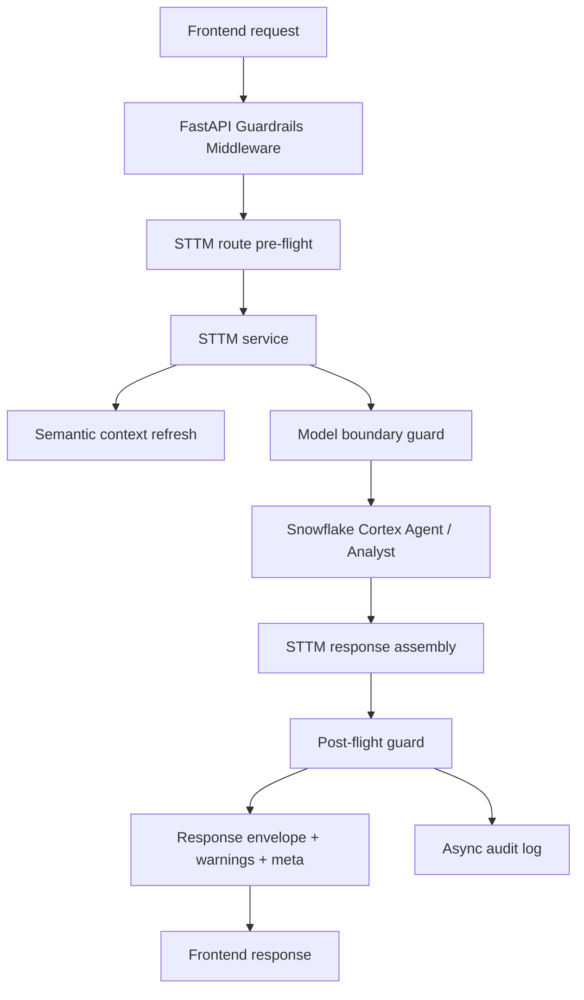
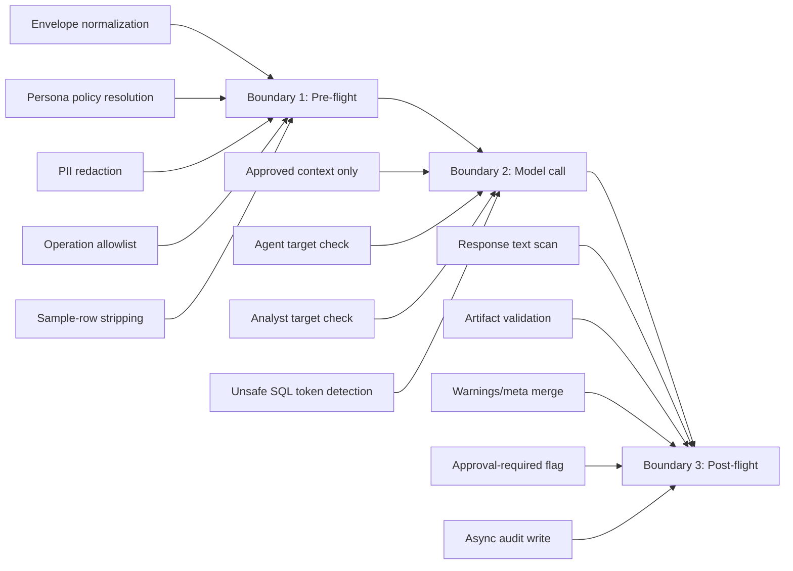
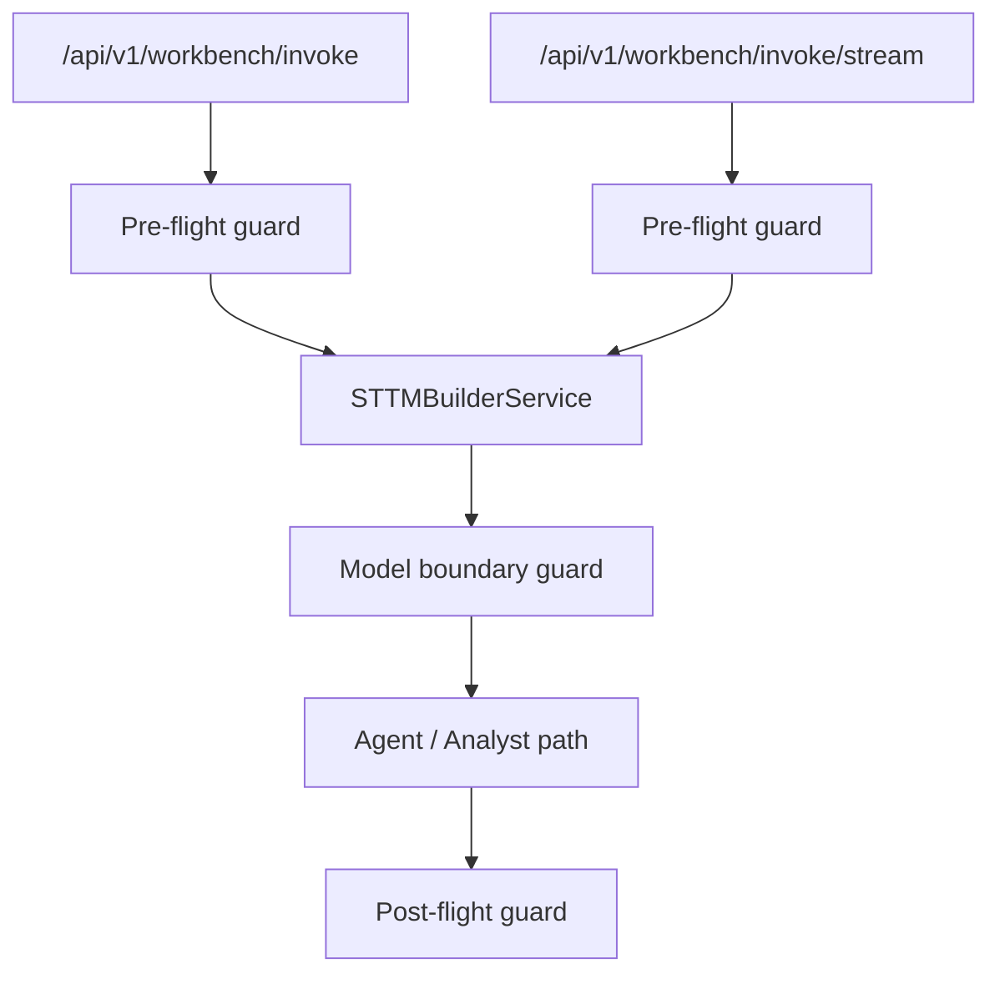
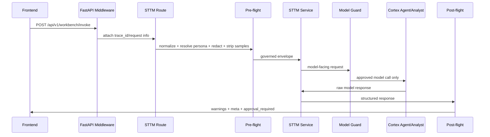

# Guardrails Foundation Overview

## Purpose

This document explains the first implemented guardrails and governance foundation on branch `feature/guardrails-foundation`.

It answers:

- what changed
- which governance boundaries exist now
- which guardrails exist now
- where they are applied today
- what is not yet applied

This is the current implementation state, not the final target-state for the whole app.

## High-Level Result

We added a new in-repo reusable package under:

- [services/sttm-builder/app/guardrails](/Users/ankurshome/Desktop/storage/Mr-Bucky/bbi-mig-ai-workbench/services/sttm-builder/app/guardrails)

This package is wired into the main STTM flow and gives us a 3-boundary model:

1. Pre-flight
2. Model boundary
3. Post-flight

It also adds:

- trace propagation
- response guardrail metadata
- warning enrichment
- async audit logging
- debug route hardening
- safer token logging
- tighter non-local CORS behavior

## What Changed

### New package structure

Added:

- `guardrails/config`
- `guardrails/contracts`
- `guardrails/policies`
- `guardrails/runtime`
- `guardrails/adapters`
- `guardrails/observability`
- `guardrails/integrations`

Main files:

- [config/schema.py](/Users/ankurshome/Desktop/storage/Mr-Bucky/bbi-mig-ai-workbench/services/sttm-builder/app/guardrails/config/schema.py)
- [config/loader.py](/Users/ankurshome/Desktop/storage/Mr-Bucky/bbi-mig-ai-workbench/services/sttm-builder/app/guardrails/config/loader.py)
- [contracts/decisions.py](/Users/ankurshome/Desktop/storage/Mr-Bucky/bbi-mig-ai-workbench/services/sttm-builder/app/guardrails/contracts/decisions.py)
- [policies/resolver.py](/Users/ankurshome/Desktop/storage/Mr-Bucky/bbi-mig-ai-workbench/services/sttm-builder/app/guardrails/policies/resolver.py)
- [policies/redaction.py](/Users/ankurshome/Desktop/storage/Mr-Bucky/bbi-mig-ai-workbench/services/sttm-builder/app/guardrails/policies/redaction.py)
- [runtime/preflight.py](/Users/ankurshome/Desktop/storage/Mr-Bucky/bbi-mig-ai-workbench/services/sttm-builder/app/guardrails/runtime/preflight.py)
- [runtime/model_boundary.py](/Users/ankurshome/Desktop/storage/Mr-Bucky/bbi-mig-ai-workbench/services/sttm-builder/app/guardrails/runtime/model_boundary.py)
- [runtime/postflight.py](/Users/ankurshome/Desktop/storage/Mr-Bucky/bbi-mig-ai-workbench/services/sttm-builder/app/guardrails/runtime/postflight.py)
- [runtime/output_validator.py](/Users/ankurshome/Desktop/storage/Mr-Bucky/bbi-mig-ai-workbench/services/sttm-builder/app/guardrails/runtime/output_validator.py)
- [observability/tracer.py](/Users/ankurshome/Desktop/storage/Mr-Bucky/bbi-mig-ai-workbench/services/sttm-builder/app/guardrails/observability/tracer.py)
- [observability/audit_log.py](/Users/ankurshome/Desktop/storage/Mr-Bucky/bbi-mig-ai-workbench/services/sttm-builder/app/guardrails/observability/audit_log.py)
- [integrations/fastapi.py](/Users/ankurshome/Desktop/storage/Mr-Bucky/bbi-mig-ai-workbench/services/sttm-builder/app/guardrails/integrations/fastapi.py)

### Existing backend files changed

Changed:

- [services/sttm-builder/app/main.py](/Users/ankurshome/Desktop/storage/Mr-Bucky/bbi-mig-ai-workbench/services/sttm-builder/app/main.py)
- [services/sttm-builder/app/routers/sttm_builder.py](/Users/ankurshome/Desktop/storage/Mr-Bucky/bbi-mig-ai-workbench/services/sttm-builder/app/routers/sttm_builder.py)
- [services/sttm-builder/app/core/sttm_builder.py](/Users/ankurshome/Desktop/storage/Mr-Bucky/bbi-mig-ai-workbench/services/sttm-builder/app/core/sttm_builder.py)
- [services/sttm-builder/app/schema/contracts.py](/Users/ankurshome/Desktop/storage/Mr-Bucky/bbi-mig-ai-workbench/services/sttm-builder/app/schema/contracts.py)
- [services/sttm-builder/app/core/config.py](/Users/ankurshome/Desktop/storage/Mr-Bucky/bbi-mig-ai-workbench/services/sttm-builder/app/core/config.py)
- [services/sttm-builder/app/core/snowflake.py](/Users/ankurshome/Desktop/storage/Mr-Bucky/bbi-mig-ai-workbench/services/sttm-builder/app/core/snowflake.py)
- [services/sttm-builder/app/api/error_handlers.py](/Users/ankurshome/Desktop/storage/Mr-Bucky/bbi-mig-ai-workbench/services/sttm-builder/app/api/error_handlers.py)

### Tests added

Added:

- [services/sttm-builder/tests/unit/guardrails/test_preflight.py](/Users/ankurshome/Desktop/storage/Mr-Bucky/bbi-mig-ai-workbench/services/sttm-builder/tests/unit/guardrails/test_preflight.py)
- [services/sttm-builder/tests/unit/guardrails/test_output_validator.py](/Users/ankurshome/Desktop/storage/Mr-Bucky/bbi-mig-ai-workbench/services/sttm-builder/tests/unit/guardrails/test_output_validator.py)
- [services/sttm-builder/tests/unit/guardrails/test_contract_integration.py](/Users/ankurshome/Desktop/storage/Mr-Bucky/bbi-mig-ai-workbench/services/sttm-builder/tests/unit/guardrails/test_contract_integration.py)
- [services/sttm-builder/tests/unit/guardrails/test_settings.py](/Users/ankurshome/Desktop/storage/Mr-Bucky/bbi-mig-ai-workbench/services/sttm-builder/tests/unit/guardrails/test_settings.py)
- [services/sttm-builder/tests/integration/test_guardrails_workbench_routes.py](/Users/ankurshome/Desktop/storage/Mr-Bucky/bbi-mig-ai-workbench/services/sttm-builder/tests/integration/test_guardrails_workbench_routes.py)

## Current Architecture

### End-to-end flow



### The 3 implemented boundaries



## Governance Boundaries Implemented

### Boundary 1: Pre-flight

Implemented in:

- [routers/sttm_builder.py](/Users/ankurshome/Desktop/storage/Mr-Bucky/bbi-mig-ai-workbench/services/sttm-builder/app/routers/sttm_builder.py)
- [runtime/preflight.py](/Users/ankurshome/Desktop/storage/Mr-Bucky/bbi-mig-ai-workbench/services/sttm-builder/app/guardrails/runtime/preflight.py)

What it does now:

- normalizes STTM payloads to the standard envelope first
- resolves the current persona from request auth state
- checks whether the operation is allowed for that persona
- redacts free-text PII from `data`
- strips sample rows and sample values from context when policy does not allow them
- injects `trace_id`
- adds initial guardrails metadata into `meta.guardrails`

Current effective persona defaults:

- `VIEWER`: allowed STTM + semantic-model read/generate operations, no sample rows, no raw PII
- `PUBLISHER`: same as above, no sample rows, no raw PII
- `ADMIN`: same operations, sample rows allowed, no raw PII

### Boundary 2: Model boundary

Implemented in:

- [core/sttm_builder.py](/Users/ankurshome/Desktop/storage/Mr-Bucky/bbi-mig-ai-workbench/services/sttm-builder/app/core/sttm_builder.py)
- [runtime/model_boundary.py](/Users/ankurshome/Desktop/storage/Mr-Bucky/bbi-mig-ai-workbench/services/sttm-builder/app/guardrails/runtime/model_boundary.py)

What it does now:

- ensures sanitized context is what reaches model-facing payload assembly
- blocks disallowed model targets by operation
- distinguishes `agent` and `analyst` targets
- inspects generated SQL for restricted patterns like `DROP`, `DELETE`, `INSERT`, `UPDATE`, `CREATE`, `ALTER`, `TRUNCATE`, `MERGE`, `COPY`, `PUT`, `REMOVE`
- marks responses as approval-required when risky SQL is present
- suppresses preview-row execution when SQL is flagged unsafe

### Boundary 3: Post-flight

Implemented in:

- [runtime/postflight.py](/Users/ankurshome/Desktop/storage/Mr-Bucky/bbi-mig-ai-workbench/services/sttm-builder/app/guardrails/runtime/postflight.py)
- [runtime/output_validator.py](/Users/ankurshome/Desktop/storage/Mr-Bucky/bbi-mig-ai-workbench/services/sttm-builder/app/guardrails/runtime/output_validator.py)

What it does now:

- scans response message text
- scans artifacts such as `answer_text` and `sql_text`
- adds warnings into the response envelope
- merges guardrails metadata into `response.meta.guardrails`
- sets `approval_required` when unsafe SQL is detected
- emits async audit logging

## Guardrails Implemented

### Implemented now

#### 1. Envelope guardrails

- STTM invoke requests are normalized to the standard payload envelope before governance is applied.

#### 2. Persona and operation guardrails

- Operations are checked against persona policy before the STTM service executes.

#### 3. PII guardrails

- Free-text PII redaction exists now.
- Internal regex detector works by default.
- Presidio adapter exists as an optional adapter but is not enabled by default.

#### 4. Context minimization guardrails

- sample rows and sample values are stripped from model-facing context when policy forbids them
- semantic context gets sanitized before model use

#### 5. Model-target guardrails

- agent vs analyst target checks exist in the STTM service path

#### 6. SQL artifact guardrails

- generated SQL is scanned for restricted tokens
- flagged SQL sets `approval_required`
- unsafe SQL blocks preview-row execution

#### 7. Observability guardrails

- `trace_id` propagation
- `request_id` propagation into response metadata
- audit logger for guardrails decisions

#### 8. Production hardening

- debug routes are now gated by config/env
- token logging is reduced to length-only instead of prefix/suffix token leakage
- wildcard CORS is no longer accepted blindly in non-local environments

### Not implemented yet

- Snowflake tag/classification/masking enforcement in database objects
- row access policy rollout
- audit persistence to Snowflake tables
- guardrails on all non-STTM backend routes
- full human approval workflow in UI/backend
- real-time policy admin/config management
- live Cortex Guardrails account-level verification in the deployed Snowflake account

## Where It Is Applied Today

### Fully applied now



Applied today in:

- STTM invoke route
- STTM invoke stream route
- STTM service response assembly
- STTM model-facing payload path

### Partially applied now

Applied indirectly but not route-specific:

- response envelope metadata merging in [schema/contracts.py](/Users/ankurshome/Desktop/storage/Mr-Bucky/bbi-mig-ai-workbench/services/sttm-builder/app/schema/contracts.py)
- trace header injection through middleware
- debug-route and CORS hardening in [main.py](/Users/ankurshome/Desktop/storage/Mr-Bucky/bbi-mig-ai-workbench/services/sttm-builder/app/main.py)

### Not yet applied route-by-route

Not yet fully wired into these route families:

- table selection
- derived source
- semantic context
- semantic model
- user/auth/admin routes
- agents route

Those routes can already carry some metadata through the shared envelope builder, but they do not yet all have dedicated pre-flight and post-flight governance logic the way STTM does.

## Current Guardrails Flow In Practice

### Example: STTM chat invoke



## What Was Actually Verified

Verified with tests:

- pre-flight redaction and sample stripping
- output validator unsafe SQL flagging
- response envelope merging of governance metadata
- settings behavior for debug-route gating
- STTM route integration with guardrails pre-flight
- existing STTM payload-contract tests
- existing Snowflake unit tests
- existing auth header unit tests

Verified commands run:

```bash
./venv/bin/python -m pytest services/sttm-builder/tests/unit/guardrails \
  services/sttm-builder/tests/integration/test_guardrails_workbench_routes.py \
  services/sttm-builder/tests/unit/core/test_sttm_payload_contract.py \
  services/sttm-builder/tests/unit/core/test_snowflake.py \
  services/sttm-builder/tests/unit/auth/test_headers.py

./venv/bin/python -m compileall services/sttm-builder/app
```

## What Was Not Yet Verified

Not yet verified end-to-end:

- real Snowflake Cortex Agent calls
- real Snowflake Cortex Analyst calls
- real SPCS deployed runtime behavior
- real Snowflake account-level Cortex Guardrails behavior
- live audit table persistence

So the current state is:

- code foundation: implemented
- STTM integration: implemented
- test coverage for the new boundary path: implemented
- live production/SPCS runtime validation: still pending

## How To Review The Changes

### Branches

- active implementation branch: `feature/guardrails-foundation`
- preservation branch for prior local frontend work: `codex/guardrails-base-snapshot`

### Recommended review order

1. [services/sttm-builder/app/guardrails](/Users/ankurshome/Desktop/storage/Mr-Bucky/bbi-mig-ai-workbench/services/sttm-builder/app/guardrails)
2. [services/sttm-builder/app/routers/sttm_builder.py](/Users/ankurshome/Desktop/storage/Mr-Bucky/bbi-mig-ai-workbench/services/sttm-builder/app/routers/sttm_builder.py)
3. [services/sttm-builder/app/core/sttm_builder.py](/Users/ankurshome/Desktop/storage/Mr-Bucky/bbi-mig-ai-workbench/services/sttm-builder/app/core/sttm_builder.py)
4. [services/sttm-builder/app/main.py](/Users/ankurshome/Desktop/storage/Mr-Bucky/bbi-mig-ai-workbench/services/sttm-builder/app/main.py)
5. [services/sttm-builder/tests/unit/guardrails](/Users/ankurshome/Desktop/storage/Mr-Bucky/bbi-mig-ai-workbench/services/sttm-builder/tests/unit/guardrails)

### Helpful commands

```bash
git checkout feature/guardrails-foundation
git diff codex/guardrails-base-snapshot..feature/guardrails-foundation -- services/sttm-builder
git log --oneline --decorate --graph -n 10
```

## Next Recommended Phase

If continuing from this foundation, the next best steps are:

1. Apply the same pre-flight/post-flight pattern to semantic-model, semantic-context, derived-source, and table-selection routes.
2. Add Snowflake-backed audit persistence.
3. Add explicit allow/deny policy for sample-row generation and derived-source SQL execution.
4. Validate with real agent calls in local mode.
5. Validate in SPCS with real Snowflake ingress and caller-context headers.
