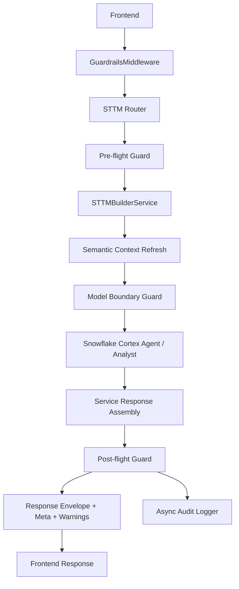
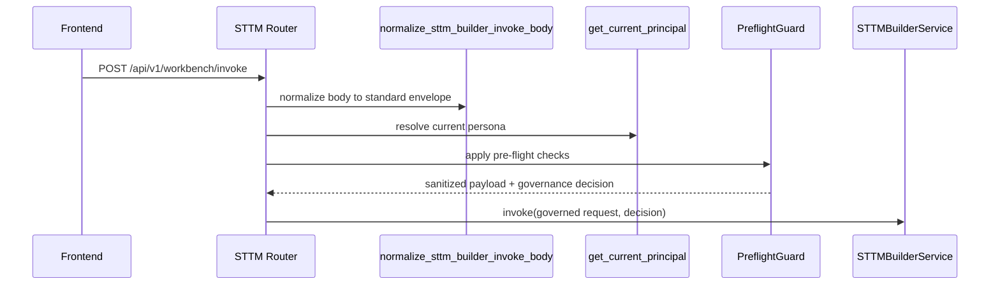
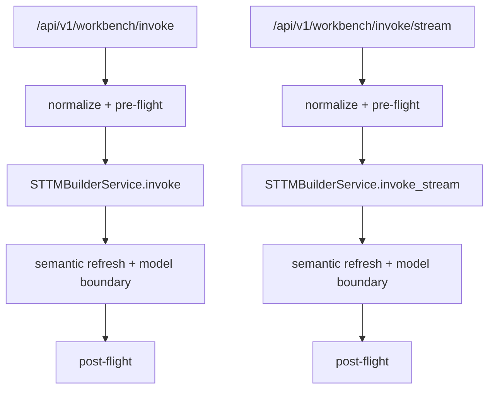

# Guardrails Team Walkthrough

## Why this document exists

This document is the detailed version of the guardrails foundation work on `feature/guardrails-foundation`.

Use it when explaining to the team:

- what was built
- where it was built
- what happens on each request
- what each check does
- what is already integrated
- what is not yet integrated

This is written as an engineering handoff and architecture walkthrough.

## Executive summary

We introduced a new reusable in-repo guardrails package for the STTM backend and integrated it into the main STTM request path.

The implemented model is:

1. Pre-flight
2. Model boundary
3. Post-flight

Today, the strongest integration is on:

- `POST /api/v1/workbench/invoke`
- `POST /api/v1/workbench/invoke/stream`

Shared guardrail-aware metadata propagation is also added at the envelope layer, so any route using the shared response builder can carry guardrails metadata when present.

## Branches involved

- active implementation branch: `feature/guardrails-foundation`
- preserved local snapshot branch: `codex/guardrails-base-snapshot`

## Files changed

### New guardrails package

- [services/sttm-builder/app/guardrails/__init__.py](/Users/ankurshome/Desktop/storage/Mr-Bucky/bbi-mig-ai-workbench/services/sttm-builder/app/guardrails/__init__.py)
- [services/sttm-builder/app/guardrails/config/schema.py](/Users/ankurshome/Desktop/storage/Mr-Bucky/bbi-mig-ai-workbench/services/sttm-builder/app/guardrails/config/schema.py)
- [services/sttm-builder/app/guardrails/config/loader.py](/Users/ankurshome/Desktop/storage/Mr-Bucky/bbi-mig-ai-workbench/services/sttm-builder/app/guardrails/config/loader.py)
- [services/sttm-builder/app/guardrails/contracts/decisions.py](/Users/ankurshome/Desktop/storage/Mr-Bucky/bbi-mig-ai-workbench/services/sttm-builder/app/guardrails/contracts/decisions.py)
- [services/sttm-builder/app/guardrails/adapters/base.py](/Users/ankurshome/Desktop/storage/Mr-Bucky/bbi-mig-ai-workbench/services/sttm-builder/app/guardrails/adapters/base.py)
- [services/sttm-builder/app/guardrails/adapters/presidio.py](/Users/ankurshome/Desktop/storage/Mr-Bucky/bbi-mig-ai-workbench/services/sttm-builder/app/guardrails/adapters/presidio.py)
- [services/sttm-builder/app/guardrails/adapters/snowflake.py](/Users/ankurshome/Desktop/storage/Mr-Bucky/bbi-mig-ai-workbench/services/sttm-builder/app/guardrails/adapters/snowflake.py)
- [services/sttm-builder/app/guardrails/policies/operation_policy.py](/Users/ankurshome/Desktop/storage/Mr-Bucky/bbi-mig-ai-workbench/services/sttm-builder/app/guardrails/policies/operation_policy.py)
- [services/sttm-builder/app/guardrails/policies/redaction.py](/Users/ankurshome/Desktop/storage/Mr-Bucky/bbi-mig-ai-workbench/services/sttm-builder/app/guardrails/policies/redaction.py)
- [services/sttm-builder/app/guardrails/policies/resolver.py](/Users/ankurshome/Desktop/storage/Mr-Bucky/bbi-mig-ai-workbench/services/sttm-builder/app/guardrails/policies/resolver.py)
- [services/sttm-builder/app/guardrails/runtime/preflight.py](/Users/ankurshome/Desktop/storage/Mr-Bucky/bbi-mig-ai-workbench/services/sttm-builder/app/guardrails/runtime/preflight.py)
- [services/sttm-builder/app/guardrails/runtime/model_boundary.py](/Users/ankurshome/Desktop/storage/Mr-Bucky/bbi-mig-ai-workbench/services/sttm-builder/app/guardrails/runtime/model_boundary.py)
- [services/sttm-builder/app/guardrails/runtime/output_validator.py](/Users/ankurshome/Desktop/storage/Mr-Bucky/bbi-mig-ai-workbench/services/sttm-builder/app/guardrails/runtime/output_validator.py)
- [services/sttm-builder/app/guardrails/runtime/postflight.py](/Users/ankurshome/Desktop/storage/Mr-Bucky/bbi-mig-ai-workbench/services/sttm-builder/app/guardrails/runtime/postflight.py)
- [services/sttm-builder/app/guardrails/observability/tracer.py](/Users/ankurshome/Desktop/storage/Mr-Bucky/bbi-mig-ai-workbench/services/sttm-builder/app/guardrails/observability/tracer.py)
- [services/sttm-builder/app/guardrails/observability/audit_log.py](/Users/ankurshome/Desktop/storage/Mr-Bucky/bbi-mig-ai-workbench/services/sttm-builder/app/guardrails/observability/audit_log.py)
- [services/sttm-builder/app/guardrails/integrations/fastapi.py](/Users/ankurshome/Desktop/storage/Mr-Bucky/bbi-mig-ai-workbench/services/sttm-builder/app/guardrails/integrations/fastapi.py)

### Existing backend files modified

- [services/sttm-builder/app/main.py](/Users/ankurshome/Desktop/storage/Mr-Bucky/bbi-mig-ai-workbench/services/sttm-builder/app/main.py)
- [services/sttm-builder/app/routers/sttm_builder.py](/Users/ankurshome/Desktop/storage/Mr-Bucky/bbi-mig-ai-workbench/services/sttm-builder/app/routers/sttm_builder.py)
- [services/sttm-builder/app/core/sttm_builder.py](/Users/ankurshome/Desktop/storage/Mr-Bucky/bbi-mig-ai-workbench/services/sttm-builder/app/core/sttm_builder.py)
- [services/sttm-builder/app/schema/contracts.py](/Users/ankurshome/Desktop/storage/Mr-Bucky/bbi-mig-ai-workbench/services/sttm-builder/app/schema/contracts.py)
- [services/sttm-builder/app/core/config.py](/Users/ankurshome/Desktop/storage/Mr-Bucky/bbi-mig-ai-workbench/services/sttm-builder/app/core/config.py)
- [services/sttm-builder/app/core/snowflake.py](/Users/ankurshome/Desktop/storage/Mr-Bucky/bbi-mig-ai-workbench/services/sttm-builder/app/core/snowflake.py)
- [services/sttm-builder/app/api/error_handlers.py](/Users/ankurshome/Desktop/storage/Mr-Bucky/bbi-mig-ai-workbench/services/sttm-builder/app/api/error_handlers.py)

### New tests

- [services/sttm-builder/tests/unit/guardrails/test_preflight.py](/Users/ankurshome/Desktop/storage/Mr-Bucky/bbi-mig-ai-workbench/services/sttm-builder/tests/unit/guardrails/test_preflight.py)
- [services/sttm-builder/tests/unit/guardrails/test_output_validator.py](/Users/ankurshome/Desktop/storage/Mr-Bucky/bbi-mig-ai-workbench/services/sttm-builder/tests/unit/guardrails/test_output_validator.py)
- [services/sttm-builder/tests/unit/guardrails/test_contract_integration.py](/Users/ankurshome/Desktop/storage/Mr-Bucky/bbi-mig-ai-workbench/services/sttm-builder/tests/unit/guardrails/test_contract_integration.py)
- [services/sttm-builder/tests/unit/guardrails/test_settings.py](/Users/ankurshome/Desktop/storage/Mr-Bucky/bbi-mig-ai-workbench/services/sttm-builder/tests/unit/guardrails/test_settings.py)
- [services/sttm-builder/tests/integration/test_guardrails_workbench_routes.py](/Users/ankurshome/Desktop/storage/Mr-Bucky/bbi-mig-ai-workbench/services/sttm-builder/tests/integration/test_guardrails_workbench_routes.py)

## Big-picture architecture



## The 3 boundaries in detail

### Boundary 1: Pre-flight

Purpose:

- decide whether the request is allowed
- reduce what the model can see
- attach trace and policy context

Primary implementation:

- [runtime/preflight.py](/Users/ankurshome/Desktop/storage/Mr-Bucky/bbi-mig-ai-workbench/services/sttm-builder/app/guardrails/runtime/preflight.py)
- [routers/sttm_builder.py](/Users/ankurshome/Desktop/storage/Mr-Bucky/bbi-mig-ai-workbench/services/sttm-builder/app/routers/sttm_builder.py)

### Boundary 2: Model boundary

Purpose:

- re-check what is about to go into agent or analyst calls
- ensure runtime-generated context does not bypass pre-flight assumptions
- inspect generated SQL before downstream preview execution

Primary implementation:

- [runtime/model_boundary.py](/Users/ankurshome/Desktop/storage/Mr-Bucky/bbi-mig-ai-workbench/services/sttm-builder/app/guardrails/runtime/model_boundary.py)
- [core/sttm_builder.py](/Users/ankurshome/Desktop/storage/Mr-Bucky/bbi-mig-ai-workbench/services/sttm-builder/app/core/sttm_builder.py)

### Boundary 3: Post-flight

Purpose:

- inspect what leaves the app
- mark risky responses
- write audit signals

Primary implementation:

- [runtime/postflight.py](/Users/ankurshome/Desktop/storage/Mr-Bucky/bbi-mig-ai-workbench/services/sttm-builder/app/guardrails/runtime/postflight.py)
- [runtime/output_validator.py](/Users/ankurshome/Desktop/storage/Mr-Bucky/bbi-mig-ai-workbench/services/sttm-builder/app/guardrails/runtime/output_validator.py)

## Request flow: exact step-by-step walkthrough

## 1. Middleware phase

File:

- [integrations/fastapi.py](/Users/ankurshome/Desktop/storage/Mr-Bucky/bbi-mig-ai-workbench/services/sttm-builder/app/guardrails/integrations/fastapi.py)

What happens:

- every request gets a `GovernanceDecision` object in `request.state`
- middleware ensures there is a `trace_id`
- if the request body is JSON, it reads `request_id` and `operation` if present
- response headers are enriched with:
  - `X-Trace-Id`
  - `X-Request-Id` when available

Important detail:

- this middleware is intentionally light
- it does not enforce full business governance by itself
- it creates the shared tracing/governance container used downstream

Key snippet:

```python
decision = get_governance_decision(request)
response.headers.setdefault("X-Trace-Id", decision.trace_id)
```

## 2. STTM route pre-flight

File:

- [routers/sttm_builder.py](/Users/ankurshome/Desktop/storage/Mr-Bucky/bbi-mig-ai-workbench/services/sttm-builder/app/routers/sttm_builder.py)

Functions added:

- `_apply_sttm_preflight(...)`

What happens:

1. incoming request body is normalized to `STTMBuilderEnvelopeRequest`
2. `request_id` is guaranteed if missing
3. current authenticated principal is resolved
4. `PreflightGuard.apply_to_sttm_request(...)` is called
5. the guarded payload is revalidated as a typed STTM envelope
6. the resulting governance decision is attached to `request.state`
7. the STTM service receives the governed request and the decision object

Mermaid flow:



## 3. Pre-flight checks: each check explained

File:

- [runtime/preflight.py](/Users/ankurshome/Desktop/storage/Mr-Bucky/bbi-mig-ai-workbench/services/sttm-builder/app/guardrails/runtime/preflight.py)

### 3.1 Operation allowlist check

What it checks:

- whether the current persona is allowed to execute the envelope `operation`

Today’s default configured operations:

- `workbench.info`
- `sttm.auto_map`
- `sttm.chat`
- `sttm.transform`
- `semantic_model.generate`
- `semantic_model.get`
- `semantic_model.job_status`

Where configured:

- [config/loader.py](/Users/ankurshome/Desktop/storage/Mr-Bucky/bbi-mig-ai-workbench/services/sttm-builder/app/guardrails/config/loader.py)

What happens on failure:

- request is blocked with `AuthorizationError`
- warning code: `OPERATION_BLOCKED`

Key logic:

```python
if not policy.allows_operation(operation):
    raise AuthorizationError(...)
```

### 3.2 Trace injection

What it checks:

- whether a `trace_id` already exists

What it does:

- guarantees `context.trace_id`
- guarantees a governance trace in metadata

Why it matters:

- allows request correlation across frontend, backend, and model-related logs

### 3.3 Free-text PII redaction

File:

- [policies/redaction.py](/Users/ankurshome/Desktop/storage/Mr-Bucky/bbi-mig-ai-workbench/services/sttm-builder/app/guardrails/policies/redaction.py)

What it checks:

- string fields inside `data`
- string fields inside `context`

Default internal patterns:

- `EMAIL`
- `PHONE`
- `SSN`
- `CREDIT_CARD`

What it does:

- replaces detected sensitive values with placeholders like:
  - `[REDACTED_EMAIL]`
  - `[REDACTED_PHONE]`

Important implementation detail:

- identifier fields such as `database`, `schema`, `table`, `target_attribute`, `operation`, `intent`, `thread_id`, `request_id` are intentionally not redacted
- that protects routing and schema context from being damaged

### 3.4 Sample-row stripping

File:

- [adapters/snowflake.py](/Users/ankurshome/Desktop/storage/Mr-Bucky/bbi-mig-ai-workbench/services/sttm-builder/app/guardrails/adapters/snowflake.py)

What it checks:

- whether policy allows sample rows for the persona

What it strips today:

- `sample_values`
- `preview_rows`
- `rows`
- `raw_rows`

Why:

- semantic context can contain sample payloads or preview values
- those are more sensitive than structural metadata

Current default behavior:

- `VIEWER`: stripped
- `PUBLISHER`: stripped
- `ADMIN`: allowed

### 3.5 Guardrails metadata injection

What is added to `meta.guardrails`:

- `trace_id`
- `persona`
- `policy`
- `redaction_count`
- `detected_pii`

This metadata becomes the seed used later by the service and post-flight logic.

## 4. STTM service phase

File:

- [core/sttm_builder.py](/Users/ankurshome/Desktop/storage/Mr-Bucky/bbi-mig-ai-workbench/services/sttm-builder/app/core/sttm_builder.py)

Main changes:

- guardrails config loaded into the service
- model-boundary guard instantiated
- post-flight guard instantiated
- `invoke(...)` and `invoke_stream(...)` now accept `governance_decision`
- request is re-governed after semantic refresh before model-facing payload build

## 5. Why there is a second governance pass before model call

This is one of the most important things to explain to the team.

Reason:

- pre-flight sanitizes the incoming request
- but the service may add new context later
- semantic refresh can enrich the request with:
  - `semantic_context`
  - `datahub_context`
  - `derived_source_lineage`
  - `semantic_view_name`
  - `semantic_bundle_id`

So we added:

- `_govern_request_for_model(...)`

What it does:

- if policy does not allow sample rows, it strips sample-like values again after semantic enrichment
- this prevents runtime-generated semantic data from bypassing the original policy

This is a key defense-in-depth point.

## 6. Model-boundary checks: each check explained

File:

- [runtime/model_boundary.py](/Users/ankurshome/Desktop/storage/Mr-Bucky/bbi-mig-ai-workbench/services/sttm-builder/app/guardrails/runtime/model_boundary.py)

### 6.1 Model target check

What it checks:

- whether the operation is allowed to use a given model target

Current target map:

- `sttm.auto_map` -> `agent`
- `sttm.transform` -> `agent`
- `sttm.chat` -> `agent`, `analyst`

Why:

- keeps operation-to-model-target behavior explicit
- prevents unexpected target usage if code changes later

### 6.2 Analyst SQL inspection

What it checks:

- generated SQL text from analyst flow

Restricted patterns:

- `DROP`
- `DELETE`
- `INSERT`
- `UPDATE`
- `CREATE`
- `ALTER`
- `TRUNCATE`
- `MERGE`
- `COPY`
- `PUT`
- `REMOVE`

What happens if found:

- response is marked `approval_required`
- warning code: `UNSAFE_SQL_ARTIFACT`
- preview-row query execution is skipped

Why:

- even if the analyst produces SQL, we should not immediately trust and preview obviously risky patterns

## 7. Post-flight checks: each check explained

Files:

- [runtime/postflight.py](/Users/ankurshome/Desktop/storage/Mr-Bucky/bbi-mig-ai-workbench/services/sttm-builder/app/guardrails/runtime/postflight.py)
- [runtime/output_validator.py](/Users/ankurshome/Desktop/storage/Mr-Bucky/bbi-mig-ai-workbench/services/sttm-builder/app/guardrails/runtime/output_validator.py)

### 7.1 Response text scan

What it checks:

- `response.message`
- `response.data.message`

What it does:

- runs the same text detector/redactor logic used earlier
- records warning `RESPONSE_PII_DETECTED` when a match is found

Current default:

- if `GUARDRAILS_REJECT_RAW_PII=false`, text is flagged but not hard-blocked
- if enabled later, redacted text can replace raw output

### 7.2 Artifact inspection

What it checks:

- `artifact.answer_text`
- `artifact.sql_text`

What it does:

- scans text for PII
- scans SQL for restricted patterns
- sets approval requirement when SQL is unsafe

### 7.3 Warning merge

What it does:

- merges governance warnings into response warnings
- avoids duplicating warning codes

### 7.4 Meta merge

What it adds to `response.meta.guardrails`:

- `trace_id`
- `request_id`
- `persona`
- `approval_required`
- `redaction_count`
- `detected_pii`

### 7.5 Async audit logging

File:

- [observability/audit_log.py](/Users/ankurshome/Desktop/storage/Mr-Bucky/bbi-mig-ai-workbench/services/sttm-builder/app/guardrails/observability/audit_log.py)

What it does today:

- sends a structured audit log entry asynchronously through a background thread
- backend is currently logger-based, not Snowflake-table-based

What gets logged:

- trace id
- request id
- operation
- persona
- approval_required flag
- warning codes
- response status/artifact summary

## 8. Shared envelope integration

File:

- [schema/contracts.py](/Users/ankurshome/Desktop/storage/Mr-Bucky/bbi-mig-ai-workbench/services/sttm-builder/app/schema/contracts.py)

What changed:

- shared response envelope builder now reads `request.state.trace_id`
- shared response envelope builder now reads `request.state.governance_decision`
- when present, it automatically merges:
  - trace id into response context
  - guardrails warnings
  - `meta.guardrails`

Why this matters:

- any route using `build_response_envelope(...)` can carry guardrails context without route-specific copy-paste

What it does not mean:

- it does not automatically mean all routes are governed
- it only means routes can now publish guardrails metadata if that metadata exists

## 9. App-level hardening changes

## 9.1 Debug route gating

Files:

- [core/config.py](/Users/ankurshome/Desktop/storage/Mr-Bucky/bbi-mig-ai-workbench/services/sttm-builder/app/core/config.py)
- [main.py](/Users/ankurshome/Desktop/storage/Mr-Bucky/bbi-mig-ai-workbench/services/sttm-builder/app/main.py)

New settings:

- `GUARDRAILS_ENABLED`
- `GUARDRAILS_DEBUG_ROUTES_ENABLED`
- `GUARDRAILS_PRESIDIO_ENABLED`
- `GUARDRAILS_REJECT_RAW_PII`

New behavior:

- `/debug/*` routes are only included if:
  - explicitly enabled, or
  - environment is local/dev/test-like

This reduces accidental exposure of diagnostic token/session endpoints in non-local environments.

## 9.2 Safer token logging

File:

- [core/snowflake.py](/Users/ankurshome/Desktop/storage/Mr-Bucky/bbi-mig-ai-workbench/services/sttm-builder/app/core/snowflake.py)

Old behavior:

- logged token prefix/suffix and length

New behavior:

- logs only that a combined caller token was built and its length

Why:

- token fragments should not appear in logs

## 9.3 Non-local wildcard CORS hardening

File:

- [main.py](/Users/ankurshome/Desktop/storage/Mr-Bucky/bbi-mig-ai-workbench/services/sttm-builder/app/main.py)

New behavior:

- wildcard CORS is skipped in non-local environments unless local dev auth is in use

Why:

- production services should not blindly allow `*`

## 10. Current code coverage map

### Fully integrated today



Implemented here:

- STTM route layer
- STTM service layer
- STTM model-facing payload path
- STTM response path
- shared response envelope metadata merge

### Partially integrated today

- middleware tracing and governance state
- generic response metadata merge for routes that use `build_response_envelope(...)`
- debug-route/CORS/token hardening at the app level

### Not yet integrated route-by-route

- `/api/v1/semantic-model/*`
- `/api/v1/semantic-context/*`
- `/api/v1/derived-source/*`
- `/api/v1/table-selection/*`
- `/api/v1/auth/*`
- `/api/v1/admin/*`
- `/api/v1/agents/*`
- `/api/v1/user/*`

These routes may inherit trace/meta improvements indirectly, but they do not yet have dedicated pre-flight/post-flight governance enforcement like STTM.

## 11. What was tested

### Tested and passing

- pre-flight redaction
- sample stripping
- output validator unsafe SQL detection
- shared envelope merge of governance state
- debug route settings behavior
- STTM route integration with pre-flight guardrails
- existing STTM payload contract tests
- existing Snowflake token/session unit tests
- existing auth header unit tests

Commands run:

```bash
./venv/bin/python -m pytest services/sttm-builder/tests/unit/guardrails \
  services/sttm-builder/tests/integration/test_guardrails_workbench_routes.py \
  services/sttm-builder/tests/unit/core/test_sttm_payload_contract.py \
  services/sttm-builder/tests/unit/core/test_snowflake.py \
  services/sttm-builder/tests/unit/auth/test_headers.py

./venv/bin/python -m compileall services/sttm-builder/app
```

### Not tested yet

- real Cortex Agent calls
- real Cortex Analyst calls
- deployed SPCS runtime behavior
- Snowflake account-level Cortex Guardrails activation/behavior
- Snowflake-backed audit persistence

## 12. Important limitation to explain clearly

This work is a **foundation** and a **real STTM integration**, but it is **not yet the full app-wide governance rollout**.

The safest way to say it to the team is:

> We have implemented the reusable guardrails framework and fully wired it into the main STTM invoke flow. Shared tracing and envelope metadata are available more broadly, and app-level hardening is in place. The next phase is applying the same guardrail boundaries to the remaining backend routes and validating the live Snowflake/SPCS runtime.

## 13. Suggested talk track for the team

If you want a short explanation in a meeting, use this:

1. We created a reusable `app/guardrails` package instead of hardcoding checks into STTM-specific code.
2. We implemented a 3-boundary model: pre-flight, model boundary, post-flight.
3. We fully applied it to the STTM invoke path first because that is where the highest-risk agent traffic is.
4. Pre-flight normalizes the envelope, resolves persona policy, redacts PII, strips sample rows, and stamps trace metadata.
5. Model boundary re-checks runtime-enriched context before agent or analyst calls and flags unsafe SQL.
6. Post-flight inspects outbound text and artifacts, adds warnings and audit metadata, and marks risky outputs for approval.
7. We also hardened debug routes, token logging, and non-local CORS.
8. The next phase is extending the same model to the other route families and then validating live Snowflake/Cortex behavior.

## 14. Next recommended engineering steps

1. Apply pre-flight and post-flight guards to semantic-model, semantic-context, derived-source, and table-selection routes.
2. Add Snowflake audit-table persistence for guardrail events.
3. Add explicit policy around sample-row generation and SQL preview execution outside STTM.
4. Run real local Snowflake/Cortex tests with actual agent inputs.
5. Run SPCS validation with real ingress caller-context headers.
